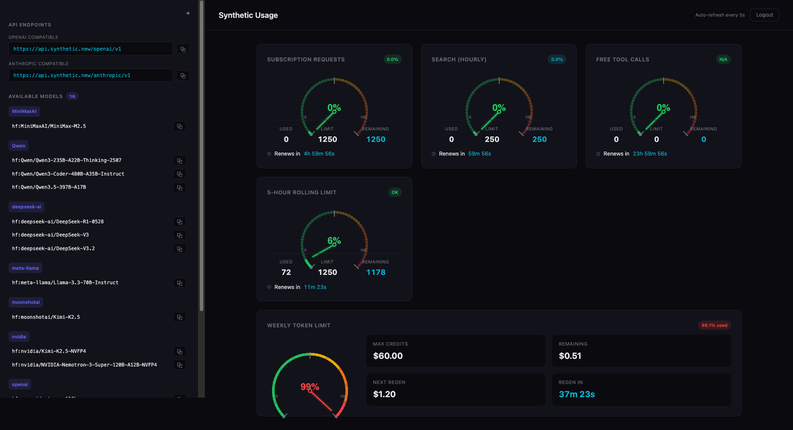

# Synthetic Usage Dashboard

A real-time dashboard for monitoring your [Synthetic](https://synthetic.new) API usage — quota limits, rate limits, token credits, and available models — all in one place with fuel-gauge visualizations and live countdowns.

  



## Features

- **Fuel-gauge visualizations** — color-coded gauges (green → yellow → orange → red) for each quota
- **Live countdowns** — real-time renewal timers using `requestAnimationFrame`
- **Auto-refresh** — quotas update every 5 seconds
- **API endpoints sidebar** — one-click copy for OpenAI and Anthropic compatible base URLs
- **Available models browser** — grouped by provider, with copy buttons
- **Key stored locally** — your API key never leaves the browser (localStorage only)
- **Dark theme** — easy on the eyes, built-in

## Dashboard Cards

| Card | What it tracks |
|---|---|
| Subscription Requests | Daily request count vs. plan limit |
| Search (Hourly) | Search API rate limit with hourly reset |
| Free Tool Calls | Free-tier tool call allowance |
| 5-Hour Rolling Limit | Rolling window usage with OK/LIMITED status |
| Weekly Token Limit | Weekly credit budget, remaining balance, and next regen countdown |

## Quick Start

```bash
git clone https://github.com/YOUR_USER/syntheticCounter.git
cd syntheticCounter
cp .env.example .env
npm install
npm run dev
```

Open `http://localhost:5173`, paste your `glhf_...` API key, and you're in.

## Configuration

Copy `.env.example` to `.env` and fill in your values:

```env
VITE_SYNTHETIC_API_KEY=       # Optional: pre-fills the login field
VITE_PORT=5173                # Dev server port
```

> **Note:** Since this is a client-side app, the API key is entered via the login screen and stored in `localStorage`. No key is ever baked into the build or sent to a server other than `api.synthetic.new`.

## Scripts

| Command | Description |
|---|---|
| `npm run dev` | Start dev server with HMR |
| `npm run build` | Production build to `dist/` |
| `npm run preview` | Preview the production build locally |
| `npm run lint` | Lint with ESLint |
| `npm run pm2` | Build and start via PM2 |
| `npm run pm2:stop` | Stop the PM2 process |

## Docker

Build and run with Docker Compose:

```bash
docker compose up --build
```

Or build manually:

```bash
docker build -t synthetic-dashboard .
docker run -p 5173:5173 synthetic-dashboard
```

The container serves the static build via Nginx on port 5173.

## Tech Stack

- **React 19** + **Vite 8**
- **TanStack React Query** — data fetching with auto-refresh
- **SVG gauges** — custom fuel-gauge components, no chart library needed
- **Nginx** — production static file serving with SPA routing

## Project Structure

```
syntheticCounter/
├── src/
│   ├── App.jsx          # Components, hooks, and layout
│   ├── App.css          # Component styles
│   ├── index.css        # Global styles and CSS variables
│   └── main.jsx         # Entry point with React Query provider
├── public/              # Static assets
├── .env.example         # Template environment file
├── Dockerfile           # Multi-stage build (Node → Nginx)
├── docker-compose.yml   # One-command deploy
├── nginx.conf           # SPA routing config
└── ecosystem.config.cjs # PM2 config
```

## License

MIT
